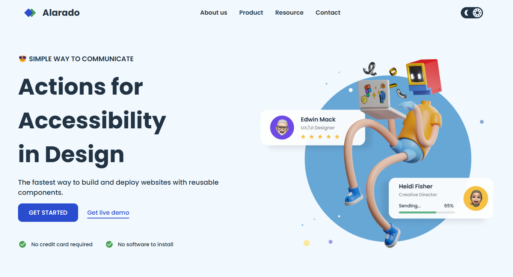

<!-- Please update value in the {}  -->

<h1 align="center">Simple Homepage Alardo | devChallenges</h1>

   Solution for a challenge <a href="https://devchallenges.io/challenge/simple-hompage-alarado" target="_blank">Simple Homepage - Alarado </a> from <a href="http://devchallenges.io" target="_blank">devChallenges.io</a>.

  <h3>
    <a href="https://gustavo2023.github.io/simple-homepage-Alarado/">
      Demo
    </a>
     | 
    <a href="https://devchallenges.io/solution/44462">
      Solution
    </a>
     | 
    <a href="https://devchallenges.io/challenge/simple-hompage-alarado">
      Challenge
    </a>
  </h3>

<!-- TABLE OF CONTENTS -->

## Table of Contents

- [Overview](#overview)
  - [What I learned](#what-i-learned)
- [Built with](#built-with)
- [Features](#features)

<!-- OVERVIEW -->

## Overview

This project is a simple homepage for "Alarado," created as part of the devChallenges platform. The homepage features a clean and modern design, built with HTML, CSS, and JavaScript. It includes a responsive layout that adapts to different screen sizes, ensuring a seamless user experience on both desktop and mobile devices.

### What I learned

- **Efficient Use of CSS Variables**: Using CSS variables for theme colors simplifies the process of switching themes and ensures consistency across the application.
- **JavaScript for Dynamic Styling**: Leveraging JavaScript to dynamically update SVG attributes and other styles based on user interactions (e.g., toggling dark mode) provides a more interactive and responsive user experience.
- **SVG Manipulation**: Inline SVGs offer greater flexibility for styling and manipulation compared to img tags, allowing for more dynamic and interactive designs.
- **User Experience Enhancements**: Adding animations and transitions can significantly enhance the user experience, making interactions feel smoother and more engaging.

### Built with

- Semantic HTML5 markup
- CSS custom properties
- Flexbox
- CSS Grid
- JavaScript

## Features

- **Responsive Design**: The layout adjusts to various screen sizes, providing an optimal viewing experience on both desktop and mobile devices.
- **Dark Mode Toggle**: Users can switch between light and dark modes, with smooth transitions and animations for enhanced user experience.
- **Sidebar Navigation**: A sidebar menu that can be toggled on and off, providing easy navigation to different sections of the site.
- **Hero Section**: A visually appealing hero section with an image and introductory text, highlighting the main features of the service.

This application/site was created as a submission to a [DevChallenges](https://devchallenges.io/challenges-dashboard) challenge.

## Author

- GitHub [@gustavo2023](https://github.com/gustavo2023)
